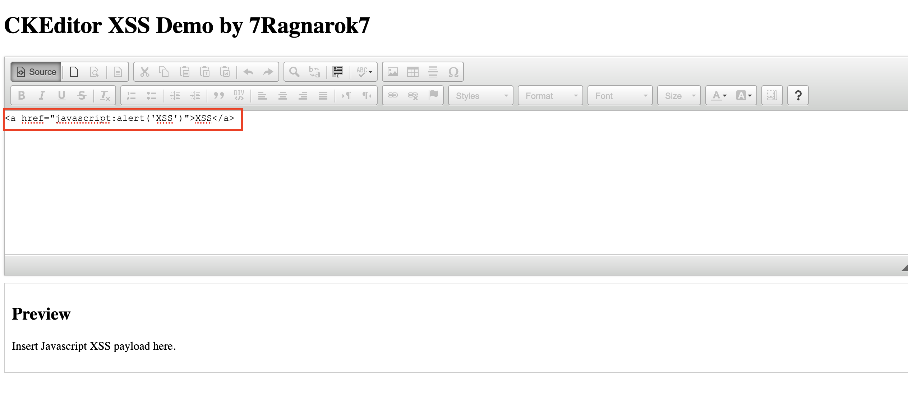
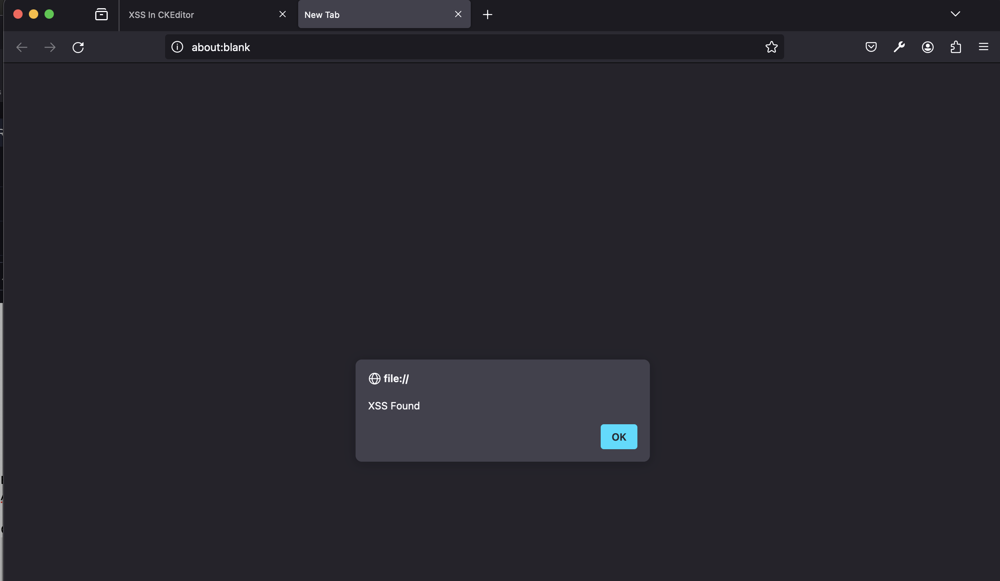
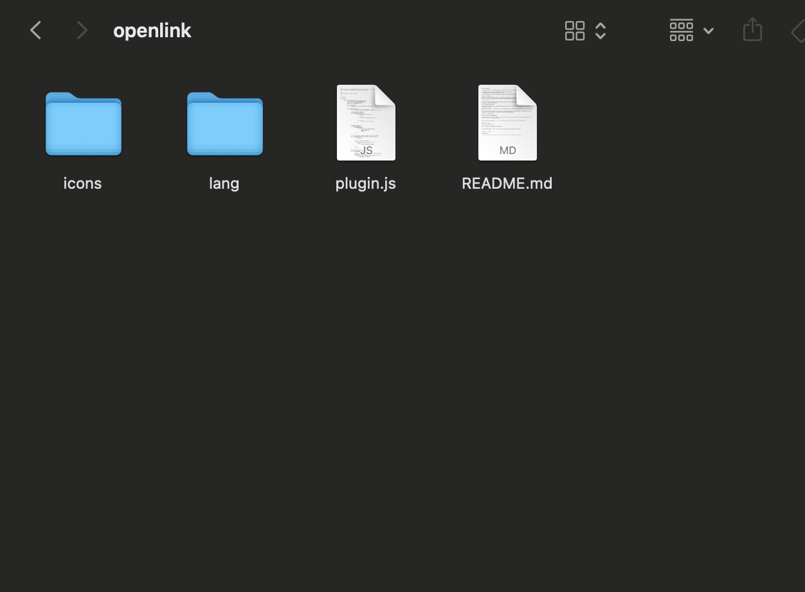

# CVE-2024-37888
This repository documents vulnerability details and exploit for CVE-2024-37888 discovered and reported by myself.

## Metrics
- [CWE-79: Improper Neutralization of Input During Web Page Generation ('Cross-site Scripting')](https://cwe.mitre.org/data/definitions/79.html)
- [CVSS: 6.1 (MEDIUM)](https://nvd.nist.gov/vuln-metrics/cvss/v3-calculator?vector=AV:N/AC:L/PR:N/UI:R/S:C/C:L/I:L/A:N&version=3.1)

## Vulnerability Overview

This Proof of Concept (POC) demonstrates the exploitation of an XSS vulnerability discovered by me recently in the Open Link plugin which when enabled, directly affects all versions of CKEditor 4. The flaw allows JavaScript execution through crafted links within the editor, which the plugin fails to sanitize. This flaw can be exploited inside the text area only when the Open Link plugin is installed. The Open Link plugin allows us to open links directly inside the editing area.

## Prerequisites

1. **CKEditor (version 4.\*.\*)**: <https://ckeditor.com/ckeditor-4/download/#ckeditor-4>
2. **Open Link Plugin (version < 1.0.5)**: <https://ckeditor.com/cke4/addon/openlink>

## Reproduction Steps

This vulnerability can be tested from the pre-configured CKEditor instance present [here](./demo).

1. **Insert Payload**:
   - Open the CKEditor instance and click on the "Source" icon.
   - Insert the following payload in the text area:

     ```html
     <a href="javascript:alert('XSS Found')">XSS</a>
     ```

   

2. **Switch to WYSIWYG Mode**:
   - Click on the "Source" icon again to switch back to the WYSIWYG mode.
   - Observe that the hyperlink becomes clickable inside the editor.

   

3. **Trigger XSS**:
   - Click on the hyperlink within the editor.
   - Observe that the XSS payload is triggered, resulting in an alert box in a new tab.

   

## Setup Instructions

You can set up your own local instance to test this vulnerability by following the below steps.

1. **Download CKEditor 4**:
   - Download the Full-Package Open-Source edition of [CKEditor 4](https://ckeditor.com/ckeditor-4/download/#ckeditor-4).

   

2. **Install Open Link Plugin**:
   - Download the Open Link plugin version 1.0.4 from [here](https://download.ckeditor.com/openlink/releases/openlink_1.0.4.zip).
   - Extract and place the contents into the `ckeditor/plugins/openlink` directory.

   

3. **Update Configuration to Include OpenLink plugin**:
   - Modify the `config.js` file of CKEditor by appending the the following lines to the end:

   ```javascript
   config.extraPlugins = 'openlink';
   config.linkShowTargetTab = false; // Hide link target tab
   config.openlink_modifier = 0; // No modifier for opening links
   config.openlink_enableReadOnly = true; // Allow links to open in read-only mode
   ```

   - Example `config.js`:

   ```javascript
   CKEDITOR.editorConfig = function( config ) {
       // Define changes to default configuration here.
       config.extraPlugins = 'openlink';
       config.linkShowTargetTab = false;
       config.openlink_modifier = 0;
       config.openlink_enableReadOnly = true;
   };
   ```

4. **Include CKEditor in HTML**:
   - Ensure the CKEditor library is included in your HTML file.

   ```html
   <!DOCTYPE html>
   <html>
   <head>
       <script src="path/to/ckeditor/ckeditor.js"></script>
   </head>
   <body>
       <textarea name="editor1" id="editor1"></textarea>
       <script>
           CKEDITOR.replace('editor1');
       </script>
   </body>
   </html>
   ```

   

## Conclusion

This vulnerability has been discovered in the code base of the [Open Link](https://github.com/mlewand/ckeditor-plugin-openlink) plugin and not in the CKEditor 4 codebase. The above POC demonstrates the exploitation of an XSS vulnerability via Open Link plugin in CKEditor 4.\*.\*. The flaw allows arbitrary JavaScript execution through specially crafted links, posing a significant security risk. 

## Advisory

- The official advisory by the Open Link plugin maintainer can be found at <https://github.com/mlewand/ckeditor-plugin-openlink/security/advisories/GHSA-rhxf-gvmh-hrxm>. 

## Additional Notice

- Note that if you want to display content from the editor elsewhere, [you should always properly filter it](https://ckeditor.com/docs/ckeditor4/latest/guide/dev_best_practices.html#filter-content-server-side).
- As for the **onclick** attribute on links, it can be disallowed by the [config.disallowedContent](https://ckeditor.com/docs/ckeditor4/latest/api/CKEDITOR_config.html#cfg-disallowedContent) configuration option:
 
```javascript
config.disallowedContent = 'a[onclick]';
```

## Important Links
- <https://github.com/mlewand/ckeditor-plugin-openlink/security/advisories/GHSA-rhxf-gvmh-hrxm>
- <https://nvd.nist.gov/vuln/detail/CVE-2024-37888>
- <https://cve.mitre.org/cgi-bin/cvename.cgi?name=CVE-2024-37888>
- <https://7ragnarok7.github.io/CVE-2024-37888/>
